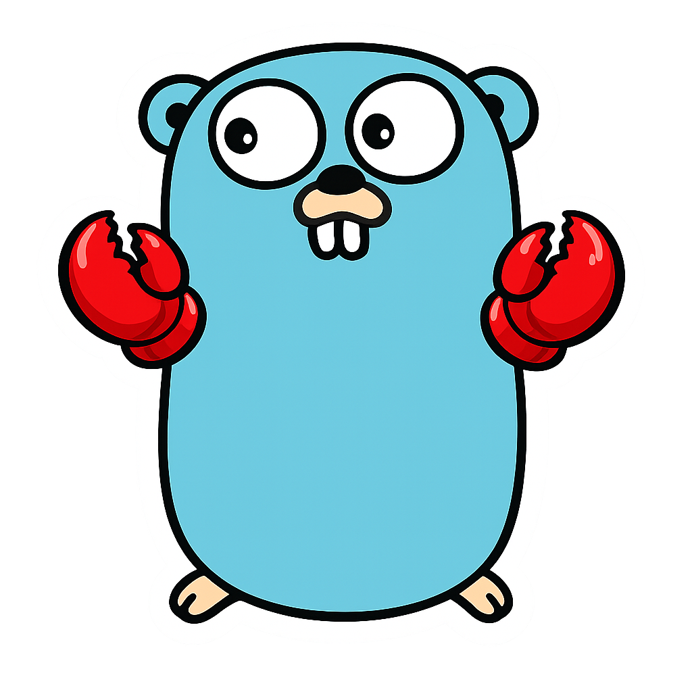

# goclaw



Minimal Go assistant runtime with SQLite-backed queues, worker/scheduler loops, and an OpenAI model backend.

## Quickstart

1. Build:

```bash
make build
```

2. Configure OpenAI:

```bash
export MODEL_BACKEND=openai
export OPENAI_API_KEY=...
export OPENAI_MODEL=gpt-5.2
```

3. Bootstrap policy file:

```bash
cp assets/goclaw.toml data/goclaw.toml
```

4. Run local terminal + scheduler:

```bash
make run-term
```

5. Run worker in another terminal:

```bash
make run-worker
```

6. Use task diagnostics if needed:

```bash
build/goclaw tasks status
```

For complete CLI/runtime reference, see `docs/reference.md`.

## Building

```bash
make build
```

Binary output:

```text
build/goclaw
```

## Testing

```bash
make fmt
make vet
make test
make test-race
```

## Developing

- Follow repository standards in `rfds/0002-repo-guidelines.md`.
- Core architecture and scope:
  - `rfds/0000-core-v1.md`
  - `rfds/0001-task-scheduler.md`
- Additional design proposals and decisions live in `rfds/`.
